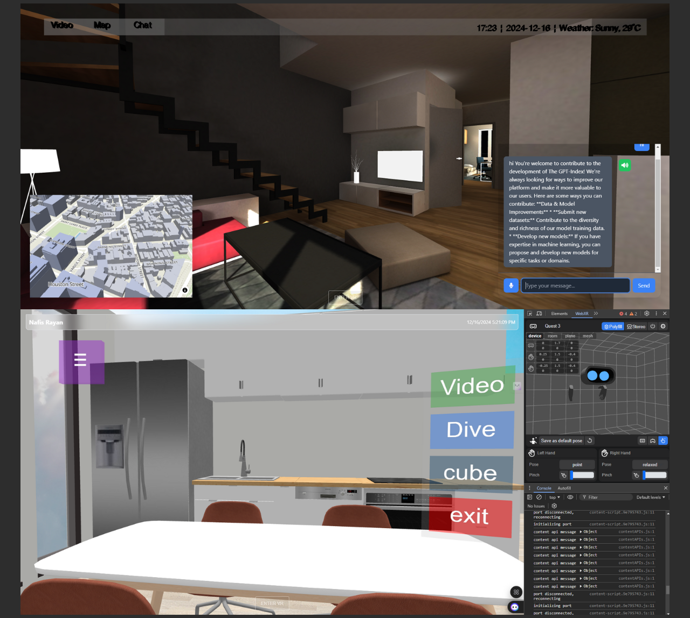

# ThreeJS-Python-Flask

This project combines Three.js, Python, and Flask to create an interactive 3D web application with real-time object detection using YOLO (You Only Look Once).

## Table of Contents

- [Project Overview](#project-overview)
- [Features](#features)
- [Technologies Used](#technologies-used)
- [Setup Instructions](#setup-instructions)
- [Usage](#usage)
- [Contributing](#contributing)

## Project Overview

This repository showcases an innovative integration of Three.js for 3D visualization, Python for backend processing, and Flask for creating a web application. The project demonstrates how to combine these technologies to build an interactive environment with real-time object detection capabilities.

## Screenshots  

Here are some screenshots of the app showcasing its key features and design:  

  

### Features

- Interactive 3D scene rendered using Three.js
- Real-time object detection using YOLO algorithm
- Web-based interface built with Flask
- Support for multiple .gltf models
- XR (Augmented Reality) support with hand tracking
- Responsive design for desktop and mobile devices

## Technologies Used

- Frontend: Three.js
- Backend: Python
- Web Framework: Flask
- Object Detection: YOLO (You Only Look Once)
- Additional Dependencies:
  - Ultralytics for YOLO integration
  - OpenCV for video processing
  - Tailwind CSS for styling

## Setup Instructions

To run this project locally, follow these steps:

1. Clone the repository:
git clone https://github.com/NafisRayan/ThreeJS-Python-Flask.git

2. Install dependencies:
pip install flask opencv-python ultralytics numpy

3. Ensure you have Node.js installed on your system.

4. Navigate to the project directory:
cd ThreeJS-Python-Flask

5. Run the Flask server:
python app.py

6. Access the application by opening a web browser and navigating to `http://localhost:5000`.

## Usage

Once the application is running, you'll see a live video feed with real-time object detection overlaid on a 3D scene. You can interact with the scene using keyboard controls or XR controllers if available.

- Use arrow keys or WASD to move the camera
- Press Space to jump
- Left-click and drag to rotate the camera
- Right-click and drag to pan the camera

For a more immersive experience, use a VR headset and controllers to explore the 3D environment.

## Contributing

Contributions are welcome! Please feel free to submit issues or pull requests.

1. Fork the repository
2. Create a new branch (`git checkout -b feature/amazing-feature`)
3. Make your changes
4. Commit your changes (`git commit -am 'Add some amazing feature'`)
5. Push to the branch (`git push origin feature/amazing-feature`)
6. Open a Pull Request
